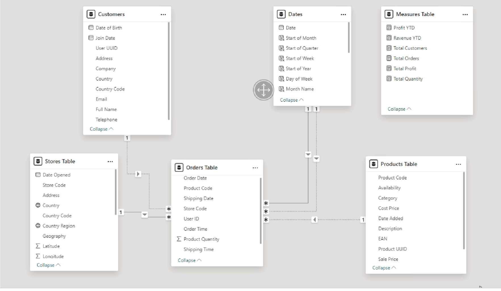

# Data-Analytics-Power-BI-Report

## Importing the Data
> This project was done on a Linux system so the processes used for some parts may differ.

For this task, there are four tables that we need to import:
- **Orders**: contains each order's details, including the order and shipping dates, the customer, store, product IDs and the quantity of each product ordered. Each order in the table is made up of an order of a single product type.
- **Products**: contains information about each product sold by the company, including the product code, name, category, cost price, sale price, and weight.
- **Stores**: contains information about each store, including the store code, store type, country, region, and address.
- **Customers**: contains information about the customers, including their full name, email, address, telephone and join date.

The **Orders** table was imported using Azure SQL Database credentials. The column 'Card Number' was deleted to ensure data privacy and the *Split Column* function was used to distinguish 
both 'Order Date' and 'Shipping Date' into corresponding columns of its dates and times. Rows with null or missing elements in the 'Order Date' column were also deleted. 

The **Products** table was in the form of a .csv file, which was uploaded onto Google Drive before being imported into Power BI from the web. The *Remove Duplcates* feature was used on the 'product_code' column to ensure that there are no duplicates of the same product. 

Next, the **Stores** table was imported using Blob Storage and the columns 'id', 'id2' and 'id3' were removed.

The **Customers** table was made up of three .csv files, each with the same column format for each region the company operates in. These files are stored in a zip file which was unzipped then imported using 'Combine and Transform' function. A new column 'Full Name' was created using the *Column from Examples* feature to merge 'First Name' and 'Last Name' columns and the 'First Name' and 'Last Name' columns were then deleted.

For every table, the columns were renamed to align with Power BI naming conventions as well as for maintaining consistency. For example, 'product_code' was changed into 'Product Code'.

## Creating the Data Model
continuous date table made, covering the time period running from start of the year containing the earliest date in the Orders['Order Date'] to end of the year containing the latest date in the Orders['Shipping Date'] column- doing this allows us use Power BI's time intelligence functions

columns in date table:
- Day of Week
- Month Number
- Month Name
- Quarter
- Year
- Start of Year
- Start of Quarter
- Start of Month
- Start of Week

relationships between the tables:
[Product Code] = products to orders
[Store Code] = stores to products
cols [User UUID] and [User ID] in customers and orders tables respectively
cols [Date] and [Order Date] in date, orders tables 
cols [Date] and [Shipping Date] in date, orders tables 

Orders[Order Date] and Date[date] active relationship, one to many, with a single filter direction flowing from dimension table to fact table 

Measures table

key measures:
- Total Orders: counts number of orders in Orders table
- Total Revenue = sum( Orders[Product Quantity] * Products[Sale_Price] )
- Total Profit = sum ( (Products[Sale_Price]- Products[Cost_Price]) * Orders[Product Quantity]
- Total Customers : counts  number of unique customers in Orders table
- Total Quantity: counts number of items sold in Orders table
- Profit YTD calculates total profit for current year
- Revenue YTD calculates total revenue for current year

Hierarchies allow to drill down into data and perform granular analysis within our report. 2 hierarchies: one for dates, one for geography

date hierarchy:
1) Start of Year
2) Start of Quarter
3) Start of Month
4) Start of Week
5) Date

new column in Stores table = Country based on the Stores[Country Code] column
GB : United Kingdom
US : United States
DE : Germany

geography column = full geography name each row, Stores[Country Region], Stores[Country] 

altering data categories
World Region : Continent
Country : Country
Country Region : State or Province

Geography hierarchy:
1) Region
2) Country
3) Country Region

